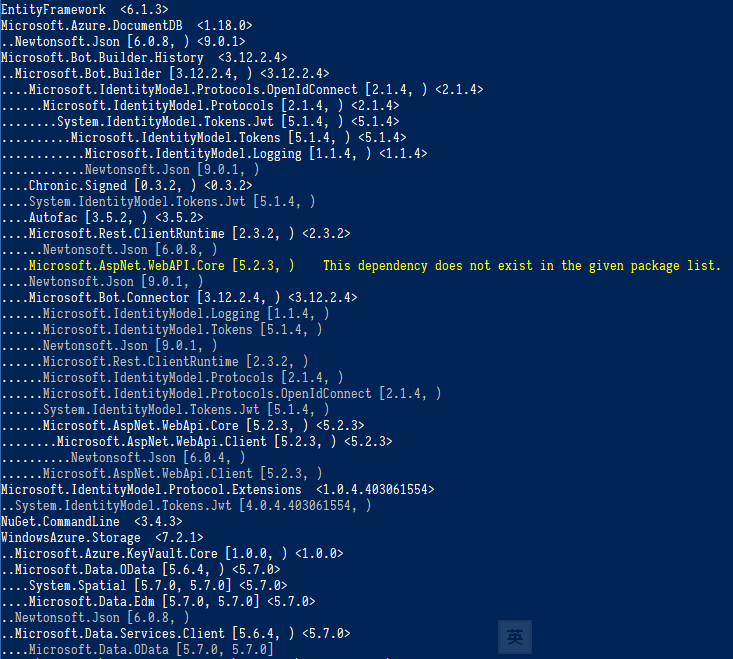

# NuGetDepends

A simple command line tool that helps you sort out the NuGet package dependency hierarchy in `packages.config`. Hopefully, this tool can reduce the pain when you are migrating an existing project to .NET Standard / .NET Core.

## Prerequisite

*   [.NET Core 2.x Runtime/SDK](https://www.microsoft.com/net/download)

## Usage

*   `git clone` this repository
*   change the current directory to `NuGetDepends` project folder
*   `dotnet run ConfigPath --framework:Framework`, where
    *   `ConfigPath` is the location of your `packages.config`, i.e. NuGet config file for .NET Framework projects
    *   `Framework` is the target framework of your project.

## Example

There is a `packages.config` in Microsoft's [`BotBuilder-Azure`](https://github.com/Microsoft/BotBuilder-Azure/tree/master/CSharp/Library/Microsoft.Bot.Builder.Azure) , a .NET Framework 4.6 library with 24 NuGet package dependencies. Obviously, some of the packages are only the dependencies of other packages. When migrating this library to .NET Standard, I need to figure out a minimal set of packages so I could keep the migrated csproj file clean & tidy.

In the project directory, use this tool as follows

```powershell
dotnet run "E:\Repos\BotBuilder-Azure\CSharp\Library\Microsoft.Bot.Builder.Azure" -framework:net46
```

After a while, the package dependency tree will be shown as follows



So for a minimal set of references, ideally I only have to add the following NuGet packages in my new csproj file

*   EntityFramework
*   Microsoft.Azure.DocumentDB
*   Microsoft.Bot.Builder.History
*   Microsoft.IdentityModel.Protocol.Extensions
*   NuGet.CommandLine
*   WindowsAzure.Storage

After some adjustments, I will be able to sort them out, such as choosing appropriate .NET Standard counterparts of the packages listed above, and ultimately, [migrate this library to .NET Standard](https://github.com/CXuesong/BotBuilder-Azure-Standard).